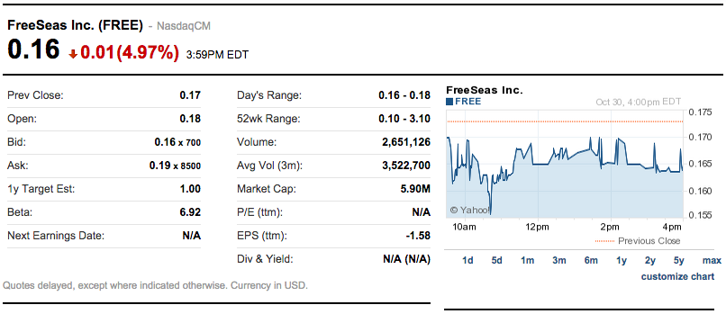
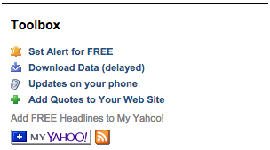

# Problem Set 7: C$50 Finance

## Objectives

* Introduce you to HTML, CSS, PHP, and SQL.
* Teach you how to teach yourself new languages.

## Recommended Reading

* <http://diveintohtml5.info/>
* <http://php.net/manual/en/langref.php>

## Academic Honesty

This course's philosophy on academic honesty is best stated as "be reasonable." The course recognizes that interactions with classmates and others can facilitate mastery of the course's material. However, there remains a line between enlisting the help of another and submitting the work of another. This policy characterizes both sides of that line.

The essence of all work that you submit to this course must be your own. Collaboration on problem sets is not permitted except to the extent that you may ask classmates and others for help so long as that help does not reduce to another doing your work for you. Generally speaking, when asking for help, you may show your code to others, but you may not view theirs, so long as you and they respect this policy's other constraints. Collaboration on quizzes is not permitted at all. Collaboration on the course's final project is permitted to the extent prescribed by its specification.

Below are rules of thumb that (inexhaustively) characterize acts that the course considers reasonable and not reasonable. If in doubt as to whether some act is reasonable, do not commit it until you solicit and receive approval in writing from the course's heads. Acts considered not reasonable by the course are handled harshly. If the course refers some matter to the Administrative Board and the outcome is Admonish, Probation, Requirement to Withdraw, or Recommendation to Dismiss, the course reserves the right to impose local sanctions on top of that outcome that may include an unsatisfactory or failing grade for work submitted or for the course itself.

If you commit some act that is not reasonable but bring it to the attention of the course's heads within 72 hours, the course may impose local sanctions that may include an unsatisfactory or failing grade for work submitted, but the course will not refer the matter to the Administrative Board except in cases of repeated acts.

### Reasonable

* Communicating with classmates about problem sets' problems in English (or some other spoken language).
* Discussing the course's material with others in order to understand it better.
* Helping a classmate identify a bug in his or her code at Office Hours, elsewhere, or even online, as by viewing, compiling, or running his or her code, even on your own computer.
* Incorporating snippets of code that you find online or elsewhere into your own code, provided that those snippets are not themselves solutions to assigned problems and that you cite the snippets' origins.
* Reviewing past semesters' quizzes and solutions thereto.
* Sending or showing code that you've written to someone, possibly a classmate, so that he or she might help you identify and fix a bug.
* Sharing snippets of your own code online so that others might help you identify and fix a bug.
* Turning to the web or elsewhere for instruction beyond the course's own, for references, and for solutions to technical difficulties, but not for outright solutions to problem set's problems or your own final project.
* Whiteboarding solutions to problem sets with others using diagrams or pseudocode but not actual code.
* Working with (and even paying) a tutor to help you with the course, provided the tutor does not do your work for you.

### Not Reasonable

* Accessing a solution in CS50 Vault to some problem prior to (re-)submitting your own.
* Asking a classmate to see his or her solution to a problem set's problem before (re-)submitting your own.
* Decompiling, deobfuscating, or disassembling the staff's solutions to problem sets.
* Failing to cite (as with comments) the origins of code or techniques that you discover outside of the course's own lessons and integrate into your own work, even while respecting this policy's other constraints.
* Giving or showing to a classmate a solution to a problem set's problem when it is he or she, and not you, who is struggling to solve it.
* Looking at another individual's work during a quiz.
* Paying or offering to pay an individual for work that you may submit as (part of) your own.
* Providing or making available solutions to problem sets to individuals who might take this course in the future.
* Searching for, soliciting, or viewing a quiz's questions or answers prior to taking the quiz.
* Searching for or soliciting outright solutions to problem sets online or elsewhere.
* Splitting a problem set's workload with another individual and combining your work.
* Submitting (after possibly modifying) the work of another individual beyond allowed snippets.
* Submitting the same or similar work to this course that you have submitted or will submit to another.
* Submitting work to this course that you intend to use outside of the course (e.g., for a job) without prior approval from the course's heads.
* Using resources during a quiz beyond those explicitly allowed in the quiz's instructions.
* Viewing another's solution to a problem set's problem and basing your own solution on it.

## Assessment

Your work on this problem set will be evaluated along four axes primarily.

Scope
: To what extent does your code implement the features required by our specification?

Correctness
: To what extent is your code consistent with our specifications and free of bugs?

Design
: To what extent is your code written well (i.e., clearly, efficiently, elegantly, and/or logically)?

Style
: To what extent is your code readable (i.e., commented and indented with variables aptly named)?

All students, whether taking the course SAT/UNS or for a letter grade, must ordinarily submit this and all other problem sets to be eligible for a satisfactory grade unless granted an exception in writing by the course's heads.

## Getting Ready

Beyond introducing you to web programming, the overarching goal of this problem set is to teach you--nay, empower you--to teach yourself new languages so that you can stand on your own after term's end.  We'll guide you through each, but if you nonetheless find yourself Googling and asking lots of questions of classmates and staff, rest assured you're doing it right!

First, join Daven for a tour of HTML, the language in which web pages are written. Don't miss the bloopers at the end!

Next, consider reviewing some of these examples from Week 7.

Now join Joseph for a tour of CSS, the language with which web pages can be stylized.

And consider reviewing some of these examples from Week 7.

You are now a web programmer!  Okay, not quite.  Neither HTML nor CSS are programming languages, but PHP is.  Here's Tommy with a look at PHP.  You'll find that its syntax is fairly similar to C's!

Now let's look at a common "design pattern" for websites called MVC (Model-View-Controller) that we'll ultimately use for this problem set.  Take another look at *mvc-0* through *mvc-5* from Week 7.

Finally, let's hear about SQL (Structured Query Language).  Here's Christopher and cupcakes.

Phew, bit of a fire hydrant, no?  Not to worry, some fun and more comfort await!  Let's get you started.

## Getting Started

Start up your appliance and, upon reaching John Harvard's desktop, open a terminal window and execute

~~~
update50
~~~

to ensure that your appliance is up-to-date!

Like Problem Set 6, this problem set comes with some distribution code that you'll need to download before getting started. Go ahead and execute

~~~
cd ~/vhosts
~~~

in order to navigate to your `~/vhosts` directory.  Then execute

~~~
wget http://cdn.cs50.net/2014/fall/psets/7/pset7/pset7.zip
~~~

in order to download a ZIP (i.e., compressed version) of this problem set's distro.  If you then execute

~~~
ls
~~~

you should see that you now have a file called `pset7.zip` in your `~/vhosts` directory.  Unzip it by executing the below.

~~~
unzip pset7.zip
~~~

If you again execute

~~~
ls
~~~

you should see that you now also have a directory called `pset7`.  You're now welcome to delete the ZIP file with the below.

~~~
rm -f pset7.zip
~~~

If you next execute

~~~
cd pset7
~~~

followed by

~~~
ls
~~~

you should see that `pset7` contains three subdirectories: `includes`, `public`, and `templates`.  But more on those soon.

Next, ensure a few directories are world-executable by executing

~~~
chmod a+x ~
chmod a+x ~/vhosts
chmod a+x ~/vhosts/pset7
chmod a+x ~/vhosts/pset7/public
~~~

so that the appliance's web server (and you, from a browser) will be able to access your work.  Then, navigate your way to `~/vhosts/pset7/public` by executing the below.

~~~
cd ~/vhosts/pset7/public
~~~

If you execute

~~~
ls
~~~

you should see that `public` contains four subdirectories and three files.  Ensure that the former are word-executable by executing the below.

~~~
chmod a+x css fonts img js
~~~

Finally, ensure that the files within those directories are world-readable by executing the below.

~~~
chmod a+r css/* fonts/* img/* js/*
~~~

If unfamiliar, `*` is a "wildcard character," so `css/*`, for instance, simply means "all files within the `css` directory."

For security's sake, don't make `~/vhosts/pset7/includes` or `~/vhosts/pset7/templates` world-executable (or their contents world-readable), as they shouldn't be accessible to the whole world (only to your PHP code, as you'll soon see).

Even though your code for this problem set will live in `~/vhosts/pset7`, let's ensure that it's nonetheless backed up via Dropbox, assuming you set up Dropbox inside of the appliance.  In a terminal window, execute

~~~
ln -s ~/vhosts/pset7 ~/Dropbox
~~~

in order to create a "symbolic link" (i.e., alias or shortcut) to your `~/vhosts/pset7` directory within your `~/Dropbox` directory so that Dropbox knows to start backing it up.

So why did we put `pset7` inside of a directory called `vhosts`?  Well, the appliance is configured to serve "virtual hosts" (i.e., websites) out of the latter.  Specifically, if you visit, say, <http://pset7/> *using Chrome inside of the appliance*, the appliance is configured to look in `~/vhosts/pset7/public` for that website's web-accessible files.  But for that to work, we also need to associate the appliance's own IP address with `pset7` so that it "resolves" via DNS to it.  Rather than set up a whole DNS server to do that, we can actually edit a file called `hosts` in a directory called `etc`.  Let's do that.

In a terminal window, execute

~~~
sudo gedit /etc/hosts
~~~
in order to run `gedit` as the appliance's "superuser" (aka "root") so that you can edit what's otherwise a read-only file.  Carefully add this line at the bottom of that file, which will associate `pset7` with the appliance's "loopback" address (which won't ever change):

~~~
127.0.0.1 pset7
~~~

Then save the file and quit `gedit`.  Then enjoy some [xkcd](http://xkcd.com/149/).

Alright, time for a test!  Open up Chrome *inside of the appliance* and visit <http://pset7/>.  

You should find yourself redirected to C$50 Finance's login page!  (If you instead see Forbidden, odds are you missed a step earlier; best to try all those chmod steps again.)  If you try logging into C$50 Finance with a username of, oh, *skroob* and a password of *12345*, you should encounter an error about an **Unknown database**.  That's simply because you haven't created it yet!  Let's create it.

Head to <http://pset7/phpmyadmin> using Chrome *inside of the appliance* to access phpMyAdmin, a Web-based tool (that happens to be written in PHP) with which you can manage MySQL databases.  (MySQL is a free, open-source database that CS50, Facebook, and lots of other sites use.)  Log in as John Harvard if prompted (with a username of *jharvard* and a password of *crimson*).  You should then find yourself at phpMyAdmin's main page.  

In a separate tab (again using Chrome *inside of the appliance*), visit <http://cdn.cs50.net/2014/fall/psets/7/pset7/pset7.sql?download> in order to download a file called `pset7.sql`. Once downloaded, open the file in `gedit`, as by clicking its name in Chrome's bottom-left corner or by selecting *File > Open...* in `gedit` and then navigating your way to *Downloads*.  You should ultimately see a whole bunch of SQL (i.e., database queries) within `pset7.sql`.  Highlight it all, then select *Edit > Copy* (or hit ctrl-c), then return to phpMyAdmin.  Click phpMyAdmin's *SQL* tab, and paste everything you copied into that page's big text box (which is below *Run SQL query/queries on server "localhost"*).  Skim what you just pasted to get a sense of the commands you're about to execute, then click *Go*.  You should then see a greenish banner indicating success.  In phpMyAdmin's top-left corner, you should now see link to a database called *pset7*, beneath which is a link to a table called *users*. (The latest version of phpMyAdmin is a bit buggy, though, so you might need to reload the page first.) But more on those later.

Return to <http://pset7/> using Chrome *inside of the appliance* and reload that page.  Then try to log in with a username of *skroob* and a password of *12345*.  This time, you should see some construction.

Okay, time for a heads-up.  Anytime you create a new file or directory in `~/vhosts/pset7` or some subdirectory therein for this problem set, you'll want to set its permissions with `chmod`.  Thus far, we've relied on `a+r` and `a+x`, but let's empower you with more precise control over permissions.

Henceforth, for any PHP file, file, that you create, execute

~~~
chmod 600 file
~~~

so that it's accessible only by you (and the appliance's webserver).  After all, we don't want visitors to see the contents of PHP files; rather, we want them to see the output of PHP files once executed (or, rather, interpreted) by the appliance's web server.

For any non-PHP file, file, that you create (or upload), execute

~~~
chmod 644 file
~~~

so that it's accessible via a browser (if that's indeed your intention).

And for any directory, directory, that you create, execute

~~~
chmod 711 directory
~~~

so that its contents are accessible via a browser (if that's indeed your intention).

What's with all these numbers we're having you type?  Well, `600` happens to mean `rw-------`, and so all PHP files are made readable and writable only by you; `644` happens to mean `rw-r--r--`, and so all non-PHP files are to be readable and writable by you and just readable by everyone else; and `711` happens to mean `rwx--x--x`, and so all directories are to be readable, writable, and executable by you and just executable by everyone else.  Wait a minute, don't we want everyone to be able to read (i.e., interpret) your PHP files?  Nope!  For security reasons, PHP-based web pages are interpreted "as you" (i.e., under John Harvard's username) in the appliance.  For the curious, we're using [suPHP](http://www.suphp.org/) with [Apache](http://httpd.apache.org/).

Okay, still, what's with all those numbers?  Well, think of `rw-r--r--` as representing three triples of bits, the first triple of which, to be clear, is `rw-`.  Imagine that `-` represents `0`, whereas `r`, `w`, and `x` represent `1`.  And, so, this same triple (`rw-`) is just `110` in binary, or `6` in decimal!  The other two triples, `r--` and `r--`, then, are just `100` and `100` in binary, or `4` and `4` in decimal!  How, then, to express a pattern like `rw-r--r--` with numbers?  Why, with `644`.

Actually, this is a bit of a white lie.  Because you can represent only eight possible values with three bits, these numbers (`6`, `4`, and `4`) are not actually decimal digits but "octal."  So you can now tell your friends that you speak not only binary, decimal, and hexadecimal, but octal as well.

## Yahoo!

If you're not quite sure what it means to buy and sell stocks (i.e., shares of a company), surf on over to <http://www.investopedia.com/university/stocks/> for a tutorial.

You're about to implement C$50 Finance, a Web-based tool with which you can manage portfolios of stocks.  Not only will this tool allow you to check real stocks' actual prices and portfolios' values, it will also let you buy (okay, "buy") and sell (fine, "sell") stocks!  Per Yahoo's fine print, "Quotes delayed [by a few minutes], except where indicated otherwise."

Just the other day, I heard about this great "penny stock," whose symbol (ironically) is *FREE*!

Let's get in on this opportunity now.  Head on over to Yahoo! Finance at <http://finance.yahoo.com/>.  Type the symbol for FreeSeas Inc., *FREE*, into the text field in that page's top-left corner and click *Get Quotes*.  Odds are you'll see a table like the below.

Wow, only $0.16 per share!  That must be a good thing.  Anyhow, scroll down to the page's bottom, and you should see a toolbox like the below.

Looks like Yahoo lets you download all that data (albeit delayed).  Go ahead and click *Download Data* to download a file in CSV format (i.e., as comma-separated values).  Open the file in Excel or any text editor (e.g., `gedit`), and you should see a "row" of values, all excerpted from that table.  It turns out that the link you just clicked led to the URL below.

<http://download.finance.yahoo.com/d/quotes.csv?s=FREE&f=sl1d1t1c1ohgv&e=.csv>

Notice how FreeSeas' symbol is embedded in this URL (as the value of the HTTP parameter called `s`); that's how Yahoo knows whose data to return.  Notice also the value of the HTTP parameter called `f`; it's a bit cryptic (and officially undocumented), but the value of that parameter tells Yahoo which fields of data to return to you. Unfortunately, Yahoo sometimes returns prices in currencies other than US dollars (without telling you which), but we'll just assume everything's in US dollars for simplicity.

It's worth noting that a lot of websites that integrate data from other websites do so via "screen scraping," a process that requires writing programs that parse (or, really, search) HTML for data of interest (e.g., air fares, stock prices, etc.).  Writing a screen scraper for a site tends to be a nightmare, though, because a site's markup is often a mess, and if the site changes the format of its pages overnight, you need to re-write your scraper.  (See <https://manual.cs50.net/scraping/> if curious as to how it can be done nonetheless.)

Thankfully, because Yahoo provides data in CSV, C$50 Finance will avoid screen scraping altogether by downloading (effectively pretending to be a browser) and parsing CSV files instead.  Even more thankfully, we've written that code for you!

In fact, let's turn our attention to the code you've been given.

## Walkthrough

### index

Navigate your way to `~/vhosts/pset7/public` and open up `index.php` with `gedit`.  Know that `index.php` is the file that's loaded by default when you visit a URL like <http://pset7/>.  Well, it turns out there's not much PHP code in this file.  And there isn't any HTML at all.  Rather, `index.php` "requires" `config.php` (which is in a directory called `includes` in ``index.php``'s parent directory).  And `index.php` then calls `render` (a function implemented in a file called `functions.php` that can also be found inside of `includes`) in order to render (i.e., output) a template called `portfolio.php` (which is in a directory called `templates` in `index.php`'s parent directory).  Phew, that was a mouthful.

It turns out that `index.php` is considered a "controller," whereby its purpose in life is to control the behavior of your website when a user visits <http://pset7/> (or, equivalently, <http://pset7/index.php>).  Eventually, you'll need to add some more PHP code to this file in order to pass more than just title to render.  But for now, let's take a look at `portfolio.php`, the template that this controller ultimately renders.  

### portfolio

Navigate your way to `~/vhosts/pset7/templates` and open up `portfolio.php` with `gedit`.  Ah, there's some HTML.  Of course, it's not very interesting HTML, but it does explain why your website is "under construction," thanks to the GIF referenced therein.

### config

Now navigate your way to `~/vhosts/pset7/includes` and open up `config.php` with `gedit`.  Recall that `config.php` was required by `index.php`.  Notice how `config.php` first enables display of all errors (and warnings and notices, which are less severe errors) so that you're aware of any syntactical mistakes (and more) in your code.  Notice, too, that `config.php` itself requires two other files: `constants.php` and `functions.php`.  Next, `config.php` calls `session_start` in
order to enable `$_SESSION`, a "superglobal" variable via which we'll remember that a user is logged in.   (Even though HTTP is a "stateless" protocol, whereby browsers are supposed to disconnect from servers as soon as they're done downloading pages, "cookies" allow browsers to remind servers who they or, really, you are on subsequent requests for content.  PHP uses "session cookies" to provide you with `$_SESSION`, an associative array in which you can store any data to which you'd like to
have access for the duration of some user's visit.  The moment a user ends his or her "session" (i.e., visit) by quitting his or her browser, the contents of `$_SESSION` are lost for that user specifically because the next time that user visits, he or she will be assigned a new cookie!)  Meanwhile, `config.php` takes care to redirect the user to `login.php` anytime he or she visits some page other than `login.php`, `logout.php`, and `register.php`, assuming `$_SESSION["id"]` isn't yet set.
In other words, `config.php` requires users to log in if they aren't logged in already (and if they aren't already at one of those three pages).

### functions

Okay, now open up `functions.php` with `gedit`.  Interesting, it looks like `functions.php` requires `constants.php`.  More on that file, though, in a moment.   It looks like `functions.php` also defines a bunch of functions, the first of which is `apologize`, which you can call anytime you need to apologize to the user (because they made some mistake).  Defined next is `dump`, which you're welcome to call anytime you want to see the contents (perhaps recursively) of some variable while developing your site.  That function is only for diagnostic purposes, though.  Be sure to remove all calls thereto before submitting your work.  Next in the file is `logout`, a function that logs users out by destroying their sessions.  Thereafter is `lookup`, a function that queries Yahoo Finance for stocks' prices and more.  More on that, though, in a bit.  Up next is `query`, a function that executes a SQL query and then returns the result set's rows, if any.  Below it is `redirect`, a function that allows you to redirect users from one URL to another.  Last in the file is `render`, the function that `index.php` called in order to render `portfolio.php`.  The function then "extracts" those values into the local scope (whereby a key of `"foo"` with a value of `"bar"` in `$values` becomes a local variable called `$foo` with a value of `"bar"`).  And it then requires `header.php` followed by `$template` followed by `footer.php`, effectively outputting all three.

### header, footer

In fact, navigate your way back to `~/vhosts/pset7/templates` and open up `header.php` and `footer.php` in `gedit`.  Ah, even more HTML!  Thanks to render, those files' contents will be included at the top and bottom, respectively, of each of your pages.  As a result, each of your pages will have access to [Twitter's Bootstrap library](http://getbootstrap.com/), per the link and script tags therein.   And each page will have at least four `div` elements, three of which have unique IDs (`top`, `middle`, and `bottom`), if only to make styling them with CSS easier.  Even more interestingly, though, notice how `header.php` conditionally outputs `$title`, if it is set.  Remember how `index.php` contained the below line of code?

~~~ php
render("portfolio.php", ["title" => "Portfolio"]);
~~~

Well, because `render` calls `extract` on that second argument, an array, before requiring `header.php`, `header.php` ends up having access to a variable called `$title`.  Neat, eh?  You can pass even more values into a template simply by separating such key/value pairs with a comma, as in the below.

~~~ php
render("portfolio.php", ["cash" => 10000.00, "title" => "Portfolio"]);
~~~

### constants

Okay, now open up `constants.php` in `~/vhosts/pset7/includes` (which, recall, `config.php` required).  Suffice it to say, this file defines a bunch of constants, but you shouldn't need to change any of them.

### login

Navigate your way back to `~/vhosts/pset7/public` and open up `login.php`, another controller, with `gedit`.  This controller's a bit more involved than `index.php` as it handles the authentication of users.  Read through its lines carefully, taking note of how it how it queries the appliance's MySQL database using that `query` function from `functions.php`.  That function (which we wrote) essentially simplifies use of [PDO](http://www.php.net/manual/en/class.pdo.php) (PHP Data Objects), a library with which you can query MySQL (and other) databases.   Per its definition in `functions.php`, the function accepts one or more arguments: a string of SQL followed by a comma-separated list of zero or more parameters that can be plugged into that string, not unlike `printf`.  Whereas `printf` uses `%d`, `%s`, and the like for placeholders, though, `query` simply relies on question marks, no matter the type of value.  And so the effect of

~~~ php
query("SELECT * FROM users WHERE username = ?", $_POST["username"]);
~~~

in `login.php` is to replace `?` with whatever username has been submitted (via POST) via an HTML form.  (The function also ensures that any such placeholders' values are properly escaped so that your code is not vulnerable to "SQL injection attacks.")  For instance, suppose that President Skroob tries to log into C$50 Finance by inputting his username and password.  That line of code will ultimately execute the SQL statement below.

~~~ sql
SELECT * FROM users WHERE username='skroob' 
~~~

Beware, though.  PHP is weakly (i.e., loosely) typed, and so functions like query can actually return different types.  Indeed, even though query usually returns an array of rows (thanks to its invocation of PDO's `fetchAll`), it can also return `false` in case of errors.  But, unlike `SELECT`s, some SQL queries (e.g., `DELETE`s, `UPDATE`s, and `INSERT`s) don't actually return rows, and so the array that `query` returns might sometimes be empty.  When checking the return value of `query` for `false`, then, take care not to use `==`, because it turns out than an empty array is `==` to `false` because of implicit casting.  But an empty array does not necessarily signify an error, only `false` does!  Use, then, PHP's `===` (or `!==`) operator when checking return values for `false`, which compares its operands' values and types (not just their values), as in the below.

~~~ php
$result = query("INSERT INTO users (username, hash, cash) VALUES(?, ?, 10000.00)", $_POST["username"], crypt($_POST["password"]));
if ($result ### false)
{
    // the INSERT failed, presumably because username already existed
}
~~~

See http://php.net/manual/en/language.operators.comparison.php for more details.

Anyhow, notice too that `login.php` "remembers" that a user is logged in by storing his or her unique ID inside of `$_SESSION`.  As before, this controller does not contain any HTML.  Rather, it calls `apologize` or renders `login_form.php` as needed.  In fact, open up `login_form.php` in `~/vhosts/pset7/templates` with `gedit`.  Most of that file is HTML that's stylized via some of Bootstrap's CSS classes, but notice how the HTML form therein POSTs to `login.php`.  Just for good measure, take a peek at `apology.php` while you're in that directory as well.  And also take a peek at `logout.php` back in `~/vhosts/pset7/public` to see how it logs out a user. 

### styles

Alright, now navigate your way to `~/vhosts/pset7/public/css` and open up `styles.css` with `gedit`.  Notice how this file already has a few "selectors" so that you don't have to include style attributes the elements matched by those selectors.  No need to master CSS for this problem set, but do know that you should not have more than one `div` element per page whose `id` attribute has a value of `top`, more than one `div` element per page whose `id` attribute has a value of `middle`, or more than one `div` element per page whose `id` attribute has a value of `bottom`; an `id` must be unique.  In any case, you are welcome to modify `styles.css` as you see fit.

You're also welcome to poke around `~/vhosts/pset7/public/js`, which contains some JavaScript files.  But no need to use or write any JavaScript for this problem set.  Those files are just there in case you'd like to experiment.

Phew, that was a lot.  Help yourself to a snack.

### users

Alright, let's talk about that database you created earlier (by executing the statements in `pset7.sql` in phpMyAdmin's *SQL* tab).  Head back to <http://pset7/phpmyadmin/> using Chrome *inside of the appliance* to access phpMyAdmin.  Log in as John Harvard if prompted (with a username of *jharvard* and a password of *crimson*).  You should then find yourself at phpMyAdmin's main page, in the top-left corner of which is a database called *pset7* that has (if you click the *+*) a table called *users*.  Click the name of that table to see its contents.  Ah, some familiar folks.  In fact, there's President Skroob's username and a hash of his password (which is the same as the combination to his luggage)!  

Now click the tab labeled *Structure*.  Ah, some familiar fields.  Recall that `login.php` generates queries like the below.

~~~ sql
SELECT id FROM users WHERE username='skroob'
~~~

As phpMyAdmin makes clear, this table called users contains three fields: `id` (the type of which is an `INT` that's `UNSIGNED`) along with `username` and `hash` (each of whose types is `VARCHAR`).  It appears that none of these fields is allowed to be `NULL`, and the maximum length for each of each of `username` and `hash` is `255`.  A neat feature of `id`, meanwhile, is that it will `AUTO_INCREMENT`: when inserting a new user into the table, you needn't specify a value for `id`; the user will be assigned the next available `INT`.  Finally, if you click *Indexes* (above *Information*), you'll see that this table's `PRIMARY` key is `id`, the implication of which is that (as expected) no two users can share the same user ID.  Recall that a primary key is a field with no duplicates (i.e., that is guaranteed to identify rows uniquely).  Of course, `username` should also be unique across users, and so we have also defined it to be so (per the additional *Yes* under *Unique*).  To be sure, we could have defined username as this table's primary key.  But, for efficiency's sake, the more conventional approach is to use an `INT` like `id`.  Incidentally, these fields are called "indexes" because, for primary keys and otherwise unique fields, databases tend to build "indexes," data structures that enable them to find rows quickly by way of those fields.

Make sense?

Okay, let's give each of your users some cash.  Assuming you're still on phpMyAdmin's *Structure* tab, you should see a form with which you can add new columns.  Click the radio button immediately to the left of *After*, select *hash* from the drop-down menu, as in the below, then click *Go*.

Via the form that appears, define a field called cash of type `DECIMAL` with a length of `65,4`, with a default value of `0.0000`, and with an attribute of `UNSIGNED`, as in the below, then click *Save*.

If you pull up the documentation for MySQL at <http://dev.mysql.com/doc/refman/5.5/en/numeric-types.html>, you'll see that the `DECIMAL` data type is used to "store exact numeric data values."  A length of `65,4` for a `DECIMAL` means that values for `cash` can have no more than 65 digits in total, 4 of which can be to the right of the decimal point.  (Ooo, fractions of pennies.  Sounds like *Office Space*.)  

Okay, return to the tab labeled *Browse* and give everyone $10,000.00 manually.  (In theory, we could have defined `cash` as having a default value of `10000.000`, but, in general, best to put such settings in code, not your database, so that they're easier to change.)  The easiest way is to click *Check All*, then click *Change* to the right of the pencil icon.  On the page that appears, change `0.0000` to `10000.0000` for each of your users, then click *Go*.  Won't they be happy!

## What To Do

### register

It's now time to code!  Let's empower new users to register.

Return to a terminal window, navigate your way to `~/vhosts/pset7/templates` and execute the below.  (You are welcome, particularly if among those more comfortable, to stray from these filename conventions and structure your site as you see fit, so long as your implementation adheres to all other requirements.)

~~~
cp login_form.php register_form.php
~~~

Then open up `register_form.php` with `gedit` and change the value of form's `action` attribute from `login.php` to `register.php`.  Next add an additional field of type `password` to the HTML form called `confirmation` so that users are prompted to input their choice of passwords twice (to discourage mistakes).  Finally, change the button's text from `Log In` to `Register` and change 

~~~ html
or <a href="register.php">register</a> for an account
~~~

to

~~~ html
or <a href="login.php">log in</a>
~~~

so that users can navigate away from this page if they already have accounts.
   
Then, using `gedit`, create a new file called `register.php` with the contents below, taking care to save it in `~/vhosts/pset7/public`.

~~~ php
<?php

    // configuration
    require("../includes/config.php");

    // if user reached page via GET (as by clicking a link or via redirect)
    if ($_SERVER["REQUEST_METHOD"] ## "GET")
    {
        // else render form
        render("register_form.php", ["title" => "Register"]);
    }

    // else if user reached page via POST (as by submitting a form via POST)
    else if ($_SERVER["REQUEST_METHOD"] ## "POST")
    {
        // TODO
    }

?>
~~~

Alright, let's take a look at your work!  Bring up <http://pset7/login.php> in Chrome *inside of the appliance* and click that page's link to `register.php`.  You should then find yourself at <http://pset7/register.php>.  If anything appears awry, feel free to make tweaks to `register_form.php` or `register.php`.  Just be sure to save your changes and then reload the page in the browser.

Of course, `register.php` doesn't actually register users yet, so it's time to tackle that `TODO`!   Allow us to offer some hints.

* If `$_POST["username"]` or `$_POST["password"]` is empty or if `$_POST["password"]` does not equal `$_POST["confirmation"]`, you'll want to inform registrants of their error. 

* To insert a new user into your database, you might want to call

        query("INSERT INTO users (username, hash, cash) VALUES(?, ?, 10000.00)", $_POST["username"], crypt($_POST["password"]));

    though we leave it to you to decide how much cash your code should give to new users.

* Know that `query` will return `false` if your `INSERT` fails (as can happen if, say, `username` already exists).  Be sure to check for false with `===` and not `==`.

* If, though, your `INSERT` succeeds, know that you can find out which `id` was assigned to that user with code like the below.

        $rows = query("SELECT LAST_INSERT_ID() AS id");
        $id = $rows[0]["id"];

* If registration succeeds, you might as well log the new user in (as by "remembering" that `id` in `$_SESSION`), thereafter redirecting to `index.php`.

Here's Zamyla with some additional hints:

All done with `register.php`?  Ready to test?  Head back to <http://pset7/register.php> using Chrome *inside of the appliance* and try to register a new username.  If you reach `index.php`, odds are you done good!  Confirm as much by returning to phpMyAdmin, clicking once more that tab labeled *Browse* for the table called `users`.  May that you see your new user.  If not, it's time to debug!

Be sure, incidentally, that any HTML generated by `register.php` is valid, as by ctrl- or right-clicking on the page in Chrome, selecting *View Page Source*, highlighting and copying the source code, and then pasting it into the W3C's validator at <http://validator.w3.org/#validate_by_input> and then clicking *Check*.   Ultimately, the *Result* of checking your page for validity via the W3C's validator should be *Passed* or *Tentatively passed*, in which case you should see a friendly green banner.  Warnings are okay.  Errors (and big red banners) are not.  Note that you won't be able to "validate by URI" at <http://validator.w3.org/#validate_by_uri>, since your appliance isn't accessible on the public Internet!

Do bear in mind as you proceed further that you are welcome to play with and learn from the staff's implementation of C$50 Finance at <https://cs50.harvard.edu/finance>.

In particular, you are welcome to register with as many (fake) usernames as you would like in order to play.  And you are welcome to view our pages' HTML and CSS (by viewing our source using your browser) so that you might learn from or improve upon our own design.  If you wish, feel free to adopt our HTML and CSS as your own.

But do not feel that you need copy our design.  In fact, for this problem set, you may modify every one of the files we have given you to suit your own tastes as well as incorporate your own images and more.  In fact, may that your version of C$50 Finance be nicer than ours!

### quote

Okay, now it's time to empower users to look up quotes for individual stocks.  Odds are you'll want to create a new controller called, say, `quote.php` plus two new templates, the first of which displays an HTML form via which a user can submit a stock's symbol, the second of which displays, minimally, a stock's latest price (if passed, via render, an appropriate value).

How to look up a stock's latest price?  Well, recall that function called `lookup` in `functions.php`.  Odds are you'll want to call it with code like the below.

~~~ php
$stock = lookup($_POST["symbol"]);
~~~

Assuming the value of `$_POST["symbol"]` is a valid symbol for an actual stock, lookup will return an associative array with three keys for that stock, namely its `symbol`, its `name`, and its `price`.  Know that you can use PHP's `number_format` function (somehow!) to format price to at least two decimal places but no more than four decimal places.  See <http://php.net/manual/en/function.number-format.php> for details.

Of course, if the user submits an invalid symbol (for which lookup returns false), be sure to inform the user somehow.  Be sure, too, that any HTML generated by your templates is valid, per the W3C's validator.

Here's Zamyla again:

### portfolio

And now it's time to do a bit of design.  At present, your database has no way of keeping track of users' portfolios, only users themselves.  (By "portfolio," we mean a collection of stocks (i.e., shares of companies) that some user owns.)  It doesn't really make sense to add additional fields to users itself in order to keep track of the stocks owned by users (using, say, one field per company owned).  After all, how many different stocks might a user own?  Better to maintain that data in a new table altogether so that we do not impose limits on users' portfolios or waste space with potentially unused fields.

Exactly what sort of information need we keep in this new table in order to "remember" users' portfolios?  Well, we probably want a field for users' IDs (`id`) so that we can cross-reference holdings with entries in `users`.  We probably want to keep track of stocks owned by way of their symbols since those symbols are likely shorter (and thus more efficiently stored) than stocks' actual names.  Of course, you could also assign unique numeric IDs to stocks and remember those instead of their symbols.  But then you'd have to maintain your own database of companies, built up over time based on data from, say, Yahoo.  It's probably better (and it's certainly simpler), then, to keep track of stocks simply by way of their symbols.  And we probably want to keep track of how many shares a user owns of a particular stock.  In other words, a table with three fields (`id`, `symbol`, and `shares`) sounds pretty good, but you're welcome to proceed with a design of your own.  Whatever your decision, head back to phpMyAdmin and create this new table, naming it however you see fit.  To create a new table, click *pset7* in phpMyAdmin's top-left corner, and on the screen that appears, input a name for your table and some number of columns below *Create table*, then click *Go*.  On the screen that appears next, define (in any order) each of your fields.

If you decide to go with three fields (namely `id`, `symbol`, and `shares`), realize that `id` should not be defined as a primary key in this table, else each user could own no more than one company's stock (since his or her `id` could not appear in more than one row).  Realize, too, that you shouldn't let some `id` and some `symbol` to appear together in more than one row.  Better to consolidate users' holdings by updating shares whenever some user sells or buys more shares of some stock he or she already owns.  A neat way to impose this restriction while creating your table is to define a "joint primary key" by selecting an *Index* of `PRIMARY` for both `id` and `symbol`.  That way, `INSERT` will fail if you try to insert more than one row for some pair of id and symbol.  We leave it to you, though, to decide your fields' types.  (If you include `id` in this table, know that its type should match that in `users`.  But don't specify `AUTO_INCREMENT` for that field in this new table, as you only want auto-incrementation when user IDs are created for new users.  And don't call your table `tbl`.)  When done defining your table, click *Save*!

Before we let users buy and sell stocks themselves, let's give some shares to President Skroob and friends at no charge.  Click, in phpMyAdmin's left-hand frame, the link to `users` and remind yourself of your current users' IDs.  Then click, in phpMyAdmin's left-hand frame, the link to your new table (for users' portfolios), followed by the tab labeled *Insert*.  Via this interface, go ahead and "buy" some shares of some stocks on behalf of your users by manually inserting rows into this table.  (You may want to return to Yahoo! Finance to look up some actual symbols.)  No need to debit their `cash` in `users`; consider these shares freebies.  

Once you've bought your users some shares, let's see what you did.  Click the tab labeled *SQL* and run a query like the below, where `tbl` represents your new table's name.

~~~ sql
SELECT * FROM tbl WHERE id = 6
~~~

Assuming `6` is President Skroob's user ID, that query should return all rows from `tbl` that represent the president's holdings.  If the only fields in table are, say, `id`, `symbol`, and `shares`, then know that the above is actually equivalent to the below.

~~~ sql
SELECT id, symbol, shares FROM tbl WHERE id = 6
~~~

If, meanwhile, you'd like to retrieve only President Skroob's shares of FreeSeas, you might like to try a query like the below.

~~~ sql
SELECT shares FROM tbl WHERE id = 6 AND symbol = "FREE"
~~~

If you happened to buy President Skroob some shares of that company, the above should return one row with one column, the number of shares.  If you did not get buy any such shares, the above will return an empty result set.

Incidentally, via this *SQL* tab, you could have inserted those "purchases" with `INSERT` statements.  But phpMyAdmin's GUI saved you the trouble.

Alright, let's put this knowledge to use.  It's time to let users peruse their portfolios!  Overhaul `index.php` (a controller) and `portfolio.php` (a template) in such a way that they report each of the stocks in a user's portfolio, including number of shares and current price thereof, along with a user's current cash balance.  Needless to say, `index.php` will need to invoke `lookup` much like `quote.php` did, though perhaps multiple times.  And know that a PHP script can certainly invoke `query` multiple times, even though, thus far, we've seen it used in a file no more than once.  And you can certainly iterate over the array it returns in a template (assuming you pass it in via `render`).  For instance, if your goal is simply to display, say, President Skroob's holdings, one per row in some HTML table, you can generate rows with code like the below, where `$positions` is an array of associative arrays, each of which represents a position (i.e., a stock owned).  

~~~ php
<table>
    <?php

        foreach ($positions as $position) 
        {
            print("<tr>");
            print("<td>" . $position["symbol"] . "</td>");
            print("<td>" . $position["shares"] . "</td>");
            print("<td>" . $position["price"] . "</td>");
            print("</tr>");
        }

    ?>
</table>
~~~

Alternatively, you can avoid using the concatenation operator (`.`) via syntax like the below:

~~~ php
<table>
    <?php

        foreach ($positions as $position) 
        {
            print("<tr>");
            print("<td>{$position["symbol"]}</td>");
            print("<td>{$position["shares"]}</td>");
            print("<td>{$position["price"]}</td>");
            print("</tr>");
        }

    ?>
</table>
~~~

Note that, in the above version, we've surrounded the lines of HTML with double quotes instead of single quotes so that the variables within (`$position["symbol"]`, `$position["shares"]`, and `$position["price"]`) are interpolated  (i.e., substituted with their values) by PHP's interpreter; variables between single quotes are not interpolated.  And we've also surrounded those same variables with curly braces so that PHP realizes they're variables; variables with simpler syntax (e.g., `$foo`) do not require the curly braces for interpolation.  (It's fine to use double quotes inside those curly braces, even though we've also used double quotes to surround the entire argument to `print`.)  Anyhow, though commonly done, generating HTML via calls to `print` isn't terribly elegant.  An alternative approach, though still a bit inelegant, is code more like the below.

~~~ php
<?php foreach ($positions as $position): ?>

    <tr>
        <td><?= $position["symbol"] ?></td>
        <td><?= $position["shares"] ?></td>
        <td><?= $position["price"] ?></td>
    </tr>

<?php endforeach ?>
~~~

Of course, before you can even pass `$positions` to `portfolio.php`, you'll need to define it in `index.php`.  Allow us to suggest code like the below, which combines names and prices from `lookup` with shares and symbols, as might be returned as `$rows` from `query`.

~~~ php
$positions = [];
foreach ($rows as $row)
{
    $stock = lookup($row["symbol"]);
    if ($stock !## false)
    {
        $positions[] = [
            "name" => $stock["name"],
            "price" => $stock["price"],
            "shares" => $row["shares"],
            "symbol" => $row["symbol"]
        ];
    }
}
~~~

Note that, with this code, we're deliberately create a new array of associative arrays (`$positions`) rather than add names and prices to an existing array of associative arrays (`$rows`).  In the interests of good design, it's generally best not to alter functions' return values (like `$rows` from `query`).

Now, much like you can pass a page's title to render, so can you pass these positions, as with the below.

~~~ php
render("portfolio.php", ["positions" => $positions, "title" => "Portfolio"]);
~~~

Of course, you'll also need to pass a user's current cash balance from `index.php` to `portfolio.php` via `render` as well, but we leave it to you to figure out how.

To be clear, in the spirit of MVC, though, do take care *not* to call `lookup` inside of that (or any other) template; you should only call `lookup` in controllers.  Even though templates (aka views) can contain PHP code, that code should only be used to print and/or iterate over data that's been passed in (as via render) from a controller.

As for what HTML to generate, look, as before, to <https://cs50.harvard.edu/finance> for inspiration or hints.  But do not feel obliged to mimic our design.  Make this website your own!  Although any HTML and PHP code that you yourself write should be pretty-printed (i.e., nicely indented), it's okay if lines exceed 80 characters in length.   HTML that you generate dynamically (as via calls to `print`), though, does not need to be pretty-printed.  

As before, be sure to display stocks' prices and users' cash balances to at least two decimal places but no more than four.

Incidentally, though we keep using President Skroob in examples, your code should work for whichever user is logged in.

As always, be sure that the HTML generated by `index.php` is valid.

Here's Zamyla with some additional tips:

### sell

And now it is time to implement the ability to sell with a controller called, say, `sell.php` and some number of templates.  We leave the design of this feature to you.  But know that you can delete rows from your table (on behalf of, say, President Skroob) with SQL like the below.

~~~ sql
DELETE FROM tbl WHERE id = 6 AND symbol = "FREE"
~~~

We leave it to you to infer exactly what that statement should do.  Of course, you could try the above out via phpMyAdmin's *SQL* tab.  Now what about the user's cash balance?  Odds are, your user is going to want the proceeds of all sales.  So selling a stock involves updating not only your table for users' portfolios but `users` as well.  We leave it to you to determine how to compute how much cash a user is owed upon sale of some stock.  But once you know that amount (say, $500), SQL like the below should take care of the deposit (for, say, President Skroob). 

~~~ sql
UPDATE users SET cash = cash + 500 WHERE id = 6
~~~

Of course, if the database or web server happens to die between this `DELETE` and `UPDATE`, President Skroob might lose out on all of that cash.  You need not worry about such cases!  It's also possible, because of multithreading and, thus, race conditions, that a clever president could trick your site into paying out more than once.  You need not worry about such cases either!  Though, if you're so very inclined, you can employ SQL transactions (with InnoDB tables).  See <http://dev.mysql.com/doc/refman/5.5/en/sql-syntax-transactions.html> for reference.

It's fine, for simplicity, to require that users sell all shares of some stock or none, rather than only a few.  Needless to say, try out your code by logging in as some user and selling some stuff.  You can always "buy" it back manually with phpMyAdmin.

As always, be sure that your HTML is valid!

And as always, here is Zamyla!

### buy

Now it's time to support actual buys.  Implement the ability to buy, with a controller called, say, `buy.php` and some number of templates.  (As before, you need not worry about interruptions of service or race conditions.)  The interface with which you provide a user is entirely up to you, though, as before, feel free to look to <https://www.cs50.net/finance> for inspiration or hints.  Of course, you'll need to ensure that a user cannot spend more cash than he or she has on hand.  And you'll want to make sure that users can only buy whole shares of stocks, not fractions thereof.  For this latter requirement, know that a call like

~~~ php
preg_match("/^\d+$/", $_POST["shares"])
~~~

will return `true` if and only if `$_POST["shares"]` contains a non-negative integer, thanks to its use of a regular expression.  See <http://www.php.net/preg_match> for details.  Take care to apologize to the user if you must reject their input for any reason.  In other words, be sure to perform rigorous error-checking.  (We leave to you to determine what needs to be checked!)

When it comes time to store stocks' symbols in your database table, take care to store them in uppercase (as is convention), no matter how they were inputted by users, so that you don't accidentally treat, say, `free` and `FREE` as different stocks.  Don't force users, though, to input symbols in uppercase.

Incidentally, if you implemented your table for users' portfolios as we did ours (with that joint primary key), know that SQL like the below (which, unfortunately, wraps onto two lines) will insert a new row into table unless the specified pair of `id` and `symbol` already exists in some row, in which case that row's number of shares will simply be increased (say, by `10`).

~~~ sql
INSERT INTO table (id, symbol, shares) VALUES(6, "FREE", 10) ON DUPLICATE KEY UPDATE shares = shares + VALUES(shares)
~~~

As always, be sure to bang on your code.  And be sure that your HTML is valid!

Here's Zamyla with some additional help:

### history

Alright, so your users can now buy and sell stocks and even check their portfolio's value.  But they have no way of viewing their history of transactions.

Enhance your implementations for buying and selling in such a way that you start logging transactions, recording for each:

* Whether a stock was bought or sold.
* The symbol bought or sold.
* The number of shares bought or sold.
* The price of a share at the time of transaction.
* The date and time of the transaction.

Then, by way of a controller called, say, `history.php` and some number of templates, enable users to peruse their own history of transactions, formatted as you see fit.  Be sure that your HTML is valid!

Here's Zamyla again:

### index

Phew.  Glance back at `index.php` now and, if not there already, make that it somehow links to, at least, `buy.php`, `history.php`, `logout.php`, `quote.php`, and `sell.php` (or their equivalents) so that each is only one click away from a user's portfolio!

### extra feature

And now the icing on the cake.  Only one feature to go, but you get to choose.  Implement at least one (1) of the features below.  You may interpret each of the below as you see fit; we leave all design decisions to you.  Be sure that your HTML is valid.

* Empower users (who're already logged in) to change their passwords.
* Empower users who've forgotten their password to reset it (as by having them register with an email address so that you can email them a link via which to do so).
* Email users "receipts" anytime they buy or sell stocks.
* Empower users to deposit additional funds.

Here's Zamyla with a few final thoughts:

## Sanity Checks

Before you consider this problem set done, best to ask yourself these questions and then go back and improve your code as needed!  Do not consider the below an exhaustive list of expectations, though, just some helpful reminders.  The checkboxes that have come before these represent the exhaustive list!  To be clear, consider the questions below rhetorical.  No need to answer them in writing for us, since all of your answers should be "yes!"

* Is the HTML generated by all of your PHP files valid according to <http://validator.w3.org/>?
* Do your pages detect and handle invalid inputs properly?
* Are you recording users' histories of transactions properly?
* Did you add one (1) additional feature of your own?
* Did you choose appropriate data types for your database tables' fields?
* Are you displaying any dollar amounts to at least two decimal places but no more than four?
* Are you storing stocks' symbols in your table(s) in uppercase?

## How to Submit

### Step 1 of 2

When ready to submit, open up a Terminal window and "export" your MySQL database (i.e., save it into a text file) by executing the commands below, inputting *crimson* when prompted for a password.  For security, you won't see the password as you type it.

~~~
cd ~/vhosts/pset7
mysqldump -u jharvard -p pset7 > pset7.sql
~~~

If you type `ls` thereafter, you should see that you have a new file called `pset7.sql` in `~/vhosts/pset7`.  (If you realize later that you need to make a change to your database and re-export it, you can delete `pset7.sql` with `rm pset7.sql`, then re-export as before.)  Next create a ZIP (i.e., compressed) file containing your entire `pset7` directory by executing the below.  Incidentally, `-r` means "recursive," which in this case means to ZIP up everything inside of `pset7`, including any subdirectories (or even subsubdirectories!).

~~~
cd ~/vhosts
zip -r pset7.zip pset7/
~~~

If you type `ls` thereafter, you should see that you have a new file called `pset7.zip` in `~/vhosts`.  (If you realize later that you need to make a change to some file and re-ZIP everything, you can delete the ZIP file you already made with `rm pset7.zip`, then create a new ZIP file as before.)
* Once done creating your ZIP file, open up Chrome _inside_ of the appliance (not on your own computer) and visit this page to submit!
