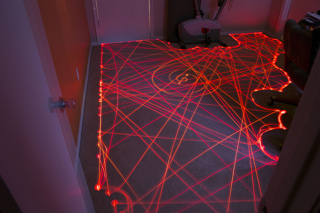

# Simulating robots

In this problem you will practice with designing a simulation and implementing a program that uses classes. Please don't be discouraged by the apparent length of this problem. There is quite a bit to read and understand, but most of the problems do not involve writing much code.

## Graphs & Math

To create plots for part 4 of this problem, you will need these Python library
packages:

- `matplotlib`: This is a package for plotting graphs, barcharts and other visual representations of numerical data. Find some [sample images] online (click on the images for the code) and don't forget the [matplotlib documentation].

- `numpy`: This is a package for scientific computing, implemented mostly with more efficient or advanced math operations. On the website you can find an introduction with some [sample code] and the [numpy documentation].

[sample images]: http://matplotlib.org/gallery.html
[matplotlib documentation]: http://matplotlib.org/contents.html

[sample code]: http://scipy.org/Getting_Started
[numpy documentation]: http://docs.scipy.org/doc/

All you have to do is verify that these packages are available in your IDLE version (there are multiple versions
on the UvA machines). You can test this by running `robots_pkgtest.py` or by simply typing

    import matplotlib, numpy

in the Shell, which should not result in any errors.

If you are working on your own machine, you will have to install the packages. You will need

* [matplotlib] Version 1.0.0 or higher
* [numpy] Version 1.5.0 or higher

[matplotlib]: http://matplotlib.org/downloads.html
[numpy]: http://sourceforge.net/projects/numpy/files/NumPy/

## Simulation Overview

iRobot is a company, started by MIT alumni and faculty, that sells the [Roomba vacuuming robot](watch one of the product videos to see these robots in action). Roomba robots move about a floor, cleaning the area they pass over.
You will design a simulation to estimate how much time a group of Roomba-like robots will take to clean the floor of a room.

[Roomba vacuuming robot]: http://store.irobot.com/category/index.jsp?categoryId=3334619&cp=2804605&ab=CMS_IRBT_Storefront_011510_vacuumcleaning

The following simplified model of a single robot moving in a square 5x5 room should give you some intuition about the system we are simulating.

The robot starts out at some random position in the room, and with a random direction of motion. The illustrations below show the robot's position (indicated by a black dot) as well as its direction (indicated by the direction of the red arrowhead).

Time t = 0: The robot starts at the position (2.1, 2.2) with an angle of 205 degrees (measured clockwise from "north"). The tile that it is on is now clean.

t = 1: The robot has moved 1 unit in the direction it was facing, to the position (1.7, 1.3), cleaning another tile.

t = 2: The robot has moved 1 unit in the same direction (205 degrees from north), to the position (1.2, 0.4),
cleaning another tile.

t = 3: The robot could not have moved another unit in the same direction without hitting the wall, so instead it
turns to face in a new, random direction, 287 degrees.

t = 4: The robot moves along its new heading to the position (0.3, 0.7), cleaning another tile.

### Simulation Details

Here are additional details about the simulation model. Read these carefully.

* *Multiple robots*: In general, there are N > 0 robots in the room, where N is given. For
simplicity, assume that robots are points and can pass through each other or occupy the
same point without interfering.
* *The room*: The room is rectangular with some integer width w and height h, which are
given. Initially the entire floor is dirty. A robot cannot pass through the walls of the room.
A robot may not move to a point outside the room.
* *Robot motion rules*:
  * Each robot has a position inside the room. We'll represent the position using
  coordinates (x, y) which are floats satisfying 0 ≤ x < w and 0 ≤ y < h. In our
  program we'll use instances of the Position class to store these coordinates.
  * A robot has a direction of motion. We'll represent the direction using an integer d
  satisfying 0 ≤ d < 360, which gives an angle in degrees.
  * All robots move at the same speed s, which is given and is constant throughout
  the simulation. Every time-step, a robot moves in its direction of motion by s
  units.
  * If a robot would've ended up hitting the wall within the time-step, it instead picks
  a new direction at random. The robot continues in that direction until it reaches
  another wall.
* *Tiles*: You will need to keep track of which parts of the floor have been cleaned by the
robot(s). We will divide the area of the room into 1x1 tiles (there will be w * hsuch tiles).
When a robot's location is anywhere in a tile, we will consider the entire tile to be
cleaned (as in the pictures above). By convention, we will refer to the tiles using ordered
pairs of integers: (0, 0), (0, 1), ..., (0, h-1), (1, 0), (1, 1), ..., (w-1, h-1).
* *Termination*: The simulation ends when a specified fraction of the tiles in the room have
been cleaned.

If you find any places above where the specification of the simulation dynamics seems ambiguous, it is up to you to make a reasonable decision about how your simulation will behave, and document that decision in your code.

## Getting Started

You will need to design two classes to keep track of which parts of the room have been cleaned as well as the position and direction of each robot. First, download the necessary [starter files](distro/robots/robots.zip).

In `robots.py`, you'll fiind skeletons for the following two classes:

* `RectangularRoom` represents the space to be cleaned and keeps track of which tiles have been cleaned.
* `Robot` stores the position and heading of a robot.

And there is a complete implementation of the following class:

* `Position` stores the x- and y-coordinates of a robot in a room.

Read `robots.py` carefully before starting, so that you understand the provided code and its capabilities.

## Modeling rooms and robots

Now it's time to implement the two empty classes! Although this problem has many parts, it should not take long once you have chosen how you wish to represent your data. For reasonable representations, *a majority of the methods will require only one line of code.*

For the `RectangularRoom` class, decide what *fields* (instance variables) you will use and decide how the following operations are to be performed:

* Initializing the object
* Marking an appropriate tile as cleaned when a robot moves to a given position
* Determining if a given tile has been cleaned
* Determining how many tiles there are in the room
* Determining how many cleaned tiles there are in the room
* Getting a random position in the room
* Determining if a given position is in the room

For the `Robot` class, decide what fields (instance variables) you will use and decide how the following operations are to be performed:

* Initializing the object
* Accessing the robot's position
* Accessing the robot's direction
* Setting the robot's position
* Setting the robot's direction

Complete the `RectangularRoom` and `Robot` classes by implementing their methods in `robots.py`.

## Defining the simulation step

Each robot must also have some code that tells it how to move about a room, which will go into a
method called `updatePositionAndClean`.

Ordinarily we would consider putting all the robot's methods in a single class. However, we will also be considering robots with alternate movement strategies, to be implemented as different classes with the same design (the same *interface*). These classes will have a different implementation of `updatePositionAndClean` but are for the most part the same as the original robots. Therefore, we'd like to use *inheritance* to reduce the amount of duplicated code.

We have already refactored the robot code for you into two classes: the `Robot` class you completed above (which contains general robot code), and a `StandardRobot` class inheriting from it (which contains its own movement strategy).

Complete the `updatePositionAndClean` method of `StandardRobot` to simulate the motion of the robot after a single time-step (as described above in the simulation dynamics).

## Running the simulation

In this problem you will write code that runs a complete robot simulation. Recall that in each trial, the objective is to determine how many time-steps are on average needed before a specified fraction of the room has been cleaned. Implement the function `runSimulation`.

The first six parameters should be self-explanatory. For the time being, you should pass in `StandardRobot` for the `robot_type` parameter, like so:

*avg = runSimulation(10, 1.0, 15, 20, 0.8, 30, StandardRobot)*

> Note: what you actually do there, is pass along the *name* of a class to that function. The function itself will then create a new *instance* of the class with that name. We can then pass any kind of class to the function (although in practice, the function only works with classes that look like a Robot). Make sure you understand how that works by asking questions!

Then, in `runSimulation` you should use `robot_type(...)` instead of `StandardRobot(...)` whenever you wish to instantiate a robot.

Hints:

- Feel free to write whatever helper functions you wish.
- We have provided the `getNewPosition` method of `Position`, which you may find helpful.

For your reference, here are some approximate room cleaning times. These times are with a robot speed of 1.0. However, these are only intended as guidelines. Depending on the exact details of your implementation, you may get times different from ours. That is probably fine, too.

* One robot takes around 150 clock ticks to completely clean a 5x5 room.
* One robot takes around 190 clock ticks to clean 75% of a 10x10 room.
* One robot takes around 310 clock ticks to clean 90% of a 10x10 room.
* One robot takes around 3250 clock ticks to completely clean a 20x20 room.

You should also check your simulation's output for speeds other than 1.0. One way to do this is to take the above test cases, change the speeds, and make sure the results are sensible.

## Visualizing the robots (fully optional)

We've provided some code to generate animations of your robots as they go about cleaning a
room. These animations can also help you debug your simulation by helping you to visually
determine when things are going wrong.

Here's how to run the visualization:

1. In your simulation, at the beginning of a trial, do the following to start an animation:

		anim = robots_animation.RobotVisualization(num_robots, width, height)

	(Pass in parameters appropriate to the trial, of course.) This will open a new window to display the animation and draw a picture of
the room.

2. Then, on each time-step, do the following to draw a new frame of the animation:

		anim.update(room, robots)
		
	Pass in a RectangularRoom object and a list of Robot objects representing the current state of the room and the robots in the room.

3. When the trial is over, call the following method:

		anim.done()

The resulting animation will look like this:

The visualization code slows down your simulation so that the animation doesn't zip by too fast
(by default, it shows 5 time-steps every second). Naturally, you will want to avoid running the
animation code if you are trying to run many trials at once (for example, when you are running
the full simulation).

For purposes of debugging your simulation, you can slow down the animation even further. You
can do this by changing the call to RobotVisualization, as follows:

	anim = robots_animation.RobotVisualization(num_robots, width, height, delay)

The parameter delay specifies how many seconds the program should pause between frames.
The default is 0.2 (that is, 5 frames per second). You can raise this value to make the animation
slower.

## Introducing Random Robot

iRobot is testing out a new robot design. The proposed new robots differ in that they change
direction randomly after every time step, rather than just when they run into walls. You have
been asked to design a simulation to determine what effect, if any, this change has on room
cleaning times.

Write a new class `RandomRobot` that inherits from `Robot` (like `StandardRobot`!) but
implements the new movement strategy. `RandomRobot` should have the same interface
as `StandardRobot`.

Test out your new class. Perform a single trial with the new `RandomRobot` implementation
and watch the visualization to make sure it is doing the right thing. Once you are satisfied, you
can call `runSimulation` again, passing the name of the class `RandomRobot` instead of `StandardRobot`.
