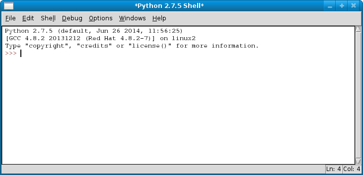
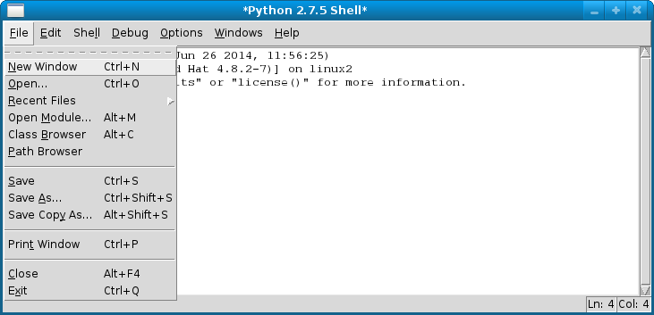
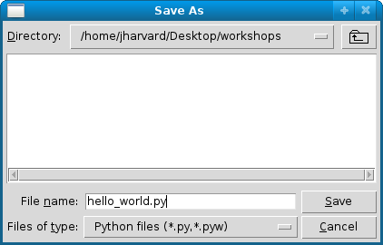

# Exercises

These exercises will take you on a trip through Python. You are supposed to try
out the code in your Python interpreter as often as possible.

## Reading 1 - Introduction and background
[The way of the program](http://www.greenteapress.com/thinkpython/html/thinkpython002.html)

## Exercise 1.0 – Installing Python

To install Python in the appliance simply execute the following two commands in the terminal:

	sudo yum install python-tools
	sudo yum install python-matplotlib
	
The first command installs Python 2.7. The second command installs several modules necessary for the
plotting of data. Ask an assistant for help if you run into any trouble!

## Interactive Python shell

Open IDLE (Integrated DeveLopment Environment) by typing idle in the terminal. By doing so 
a window with an interactive Python shell will pop up:

You can type Python code directly into this shell, at the `>>>` prompt. Whenever
you enter a complete code fragment, it will be executed. For instance, typing:

	>>> print "hello world"

and pressing ENTER, will cause the following to be displayed:

	hello world

Try typing an underscore (`_`). Can you see it? On some operating systems, the
bottoms of hanging letters such as 'g' or 'y', as well as underscorces, cannot
be seen in IDLE. If this is the case for you, go to **Options -> Configure
IDLE**, and change the size of the default font to 9 or 11. This will fix the
problem! IDLE can also be used as a calculator:

	>>> 4+4
	8
	>>> 8**3
	512

Addition (`+`), subtraction (`-`), multiplication (`*`), division (`/`), modulo
(`%`) and power (`**`) operators are built into the Python language. This means
you can use them right away. If you want to use a square root in your
calculation, you can either raise something to the power of 0.5 or you can
import the `math` module. Do not worry about what it means right now, we will
cover this later during the course. Below are two examples of square root
calculation:

	>>> 16**0.5
	4.0
	>>> import math
	>>> math.sqrt(16)
	4.0

The math module allows you to do a number of useful operations:

	>>> math.log(16, 2)
	4.0
	>>> math.cos( 0 )
	1.0

Note that you only need to execute the import command once after you start IDLE;
however you will need to execute it again if you restart the shell, as restarting
resets everything back to how it was when you opened IDLE. Don't worry too much
about this right now; we'll cover it more in depth soon!

## Exercise 1.1 – Hello, world!

Recall that a program is just a set of instructions for the computer to
execute. Let's start with a basic command `print x` which prints the value of
the expression `x`, followed by a *newline*.

Create a new program called `hello_world.py`. You will use this file to write
your very first 'Hello, world!' program. How to create a program file:

1. Open a new window by choosing **New Window** from the **File** menu.

	

2. Save the file as `hello_world.py`. Do NOT skip the `.py` portion of the file
name --- otherwise, you will lose out on syntax highlighting!

	

3. Start every program with a bank of comments, with a comment line for your
name, the name of your file, the day of the week, and today's date. Recall that
a comment line begins with a `#` (pound) symbol.

You can now write your very own *Hello, world!* program. This is the first
program that most programmers write in a new programming language. In Python,
*Hello world!* is a very simple program to write. Do this now... it should be
only be one line!

When you are done, save your work and run it. Your code should look similar to
this:

To run your program, chose **Run Module** from the **Run** menu (or just hit F5
on Windows/Linux, or fn-F5 on a Mac). When you run the code, your shell should
look similar to this:

When you run your code, it first prints the line `>>> ===== RESTART =====`, then
runs your code underneath that line. See?

## Reading 2 - Variables, expressions and statements
[Variables, expressions and statements](http://www.greenteapress.com/thinkpython/html/thinkpython003.html)

## Exercise 1.4 – Operators/Order of Operation

Python has the ability to be used as a cheap, 5-dollar calculator. In
particular, it supports basic mathematical operators `+`, `-`, `*`, `/` as well
as the power operator `**` and the modulus operator `%`.

Program Text:

{: .language-python}
	x = 5 + 7
	print x
	y = x + 10
	print y

Output:

	12
	22

Note that we can use variables in the definition of other variables!
Mathematical operators only work on numbers: `int`s or `float`s. Statements such
as `'Hi' + 5` or `'5 + 7` will not work.

**Part I**: Input the following sets of equations, and note the difference
  between `int` arithmetic and `float` arithmetic. You can do this just in your
  interpreter (you don't need to turn anything in for this part), but pay
  attention to the output!
	
1.	$$5/2$$, $$5/2.0$$, and $$5.0/2$$

	Note that as long as one argument is a float, all of your math 
	will be floating point!

2.	$$7 xx (1 / 2)$$ and $$7 xx (1 / 2.0)$$

3.	$$5^2$$, $$5.0^2$$, $$5^2.0$$

4.	$$1/3.0$$

	Note that the final digit is rounded. Python does this for non-terminating
	decimal numbers (Don't know what these are? Ask!), as computers cannot 
	store infinite numbers!

**Part II**: In `homework1.py`, transcribe the following equations into Python
  (without simplifying!), preserving order of operation with parenthesis as
  needed. Save each as the value of a variable, and then print the variable.

1.	$$(3 xx 5) / (2 + 3)$$

2.	$$sqrt(7 + 9) xx 2$$

3.	$$(4 - 7) ^ 3$$

4.	$$6 mod 4$$

	If you aren't familiar with modular arithmetic, it is pretty
	straightforward: the modulus operator, in the expression $$x mod y$$, gives
	the remainder when $$x$$ is divided by $$y$$. Try a couple of modular
	expressions until you get the hang of it.

**Part III**: In `homework1.py`, use order of operation mathematics to create
  two equations that look the same (i.e., have the same numbers) but evaluate to
  different values (due to parenthesization). Save each as the value of a
  variable, then print the variables.

## Reading 3 - Strings
Read 8.1 - 8.2
[Strings (and for loop)](http://www.greenteapress.com/thinkpython/html/thinkpython009.html)

## Exercise 1.5 – User input

Do this exercise in `homework1.py`. In this exercise, we will ask the user for
his/her first and last name, and date of birth, and print them out
formatted. Recall that you can get input from the user using the command
`raw_input("text")`, as shown in lecture.

**Note**: There are two functions to get user input. The first, `raw_input`,
  turns whatever the user inputs into a `string` automatically. The second,
  `input`, preserves type. So, if the user inputs an `int`, or a `float`, you
  will get an `int` or a `float` (rather than a `string`). Be careful though:
  you still want to use raw input if you want a string back, or otherwise the
  user will have to put quotes around their answer. Use raw input here: it's
  good for string processing, like this problem. `input` will come in handy when
  using user input to compute math, like in Exercise 1.8.

Here is an example of what this program should do:

	Enter your first name: Chuck
	Enter your last name: Norris
	Enter your date of birth:
	Month? March
	Day? 10
	Year? 1940
	Chuck Norris was born on March 10, 1940.
		
To print a string and a number in one line, you just need to separate the
arguments with a comma (this works for any two types within a print
statement). The comma adds a space between the two arguments. For example, the
lines:

{: .language-python}
	mo = 'October'
	day = '20'
	year = '1977'
	print mo, day, year

will have the output

	October 20 1977

### Pretty printing

**Optional**: Now, for something completely different... a discussion on how to
  print strings, most prettily...

Note that none of the commas are in this output! To do that you want something
like this:

{: .language-python}
	print mo, day + ',', year

The `+` sign concatenates two strings, but can only be used on two
strings. Using it on a number and a string will cause an error (because it is
ambiguous as to what you want the program to do!)

That's why it's a great idea to use raw_input for this problem; if you use input
you'd have to convert the `int` to a `string`. We'll cover this more in-depth
later on, when we get to strings, but you may want to play with string
concatenation operations now to get everything to look its prettiest.

--------------------------------------------------------------------------------

## Intermezzo: Questions

At this point, we suggest completing questions 1.9--1.11 to cement your
understanding of these topics. Just go to the next tab, answer the questions
and return here to code some more.

--------------------------------------------------------------------------------

## Reading 4 - Conditionals

Read 5.1 - 5.7
[Conditionals](http://www.greenteapress.com/thinkpython/html/thinkpython006.html)

## Exercise 1.6 – New Operators

Open up IDLE and play around with the operators from the book (look them up in
the index). Make sure that you understand how to use them and what they are
used for! The operators `==`, `!=`, `<`, `>`, `<=`, `>=` are called *relation*
operators.

They work on all types, not just numbers, and return a `Boolean`
(`True`/`False`) value. Remember, if you are using `Boolean`s, to capitalize
`True` and `False`! Here's an example shell session; try other examples you can
think of.

	>>> 5 >= 7
	False
	>>> 'abc' != 'def'
	True
	>>> x = 'abc'
	>>> x == 'abc'
	True

This next example is strange! Try to understand what's going on here, and ask if
you're confused.

	>>> a = True
	>>> b = (5 < 7)
	>>> a == b
	True

Next, the operators `+=`, `-=`, `*=`, `/=` change the value of a stored variable
in a quicker way. In the following example, we add 6 to a variable in two
different ways; note that we get the same result! Try using all of these
operators in your interpreter window before moving on.

	>>> x = 5
	>>> x = x + 6
	>>> print x
	11
	>>> y = 5
	>>> y += 6
	>>> print y
	11

--------------------------------------------------------------------------------

## Intermezzo: Questions

We strongly suggest you finish all questions now, before continuing on with the
next exercise.

--------------------------------------------------------------------------------

## Reading 5 - Loops
Read 7.1 - 7.4
[Iteration (while loop)](http://www.greenteapress.com/thinkpython/html/thinkpython008.html)

Read 8.3
[Strings (and for loop)](http://www.greenteapress.com/thinkpython/html/thinkpython009.html)

## Exercise 1.8 – For & While Loops

Create a new file called `loops.py` and use it for all parts of this
exercise. Remember the difference between input and raw input? If not, look at
Exercise 1.5 again.

Be sure to test your code for each part before moving on to the next part.

1. Using a for loop, write a program that prints out the decimal equivalents of
$$1 / 2, 1/3, 1 / 4, ..., 1/10$$.

2. Write a program using a while loop that asks the user for a number, and
prints a countdown from that number to zero. What should your program do if the
user inputs a negative number? As a programmer, you should always consider "edge
conditions" like these when you program! (Another way to put it: always assume
the users of your program will be trying to find a way to break it! If you don't
include a condition that catches negative numbers, what will your program do?)

3. Write a program using a for loop that calculates exponentials. Your program
should ask the user for a base `base` and an exponent `exp`, and calculate
`base``exp`. You can't use the `**` operator!

4. Write a program using a while loop that asks the user to enter a number that
is divisible by 2. Give the user a witty message if they enter something that is
not divisible by 2, *and make them enter a new number*. Don't let them stop
until they enter an even number! Print a congratulatory message when they
*finally* get it right.

--------------------------------------------------------------------------------

## Reading 6 - Functions
[Functions](http://www.greenteapress.com/thinkpython/html/thinkpython004.html)

Read 6.1 - 6.5
[Fruitful functions](http://www.greenteapress.com/thinkpython/html/thinkpython007.html)

Extra: Read 5.8 - 5.12
[Recursion](http://www.greenteapress.com/thinkpython/html/thinkpython006.html#toc59)

## 2.1 Print vs Return

**Important**: most of the other exercises should be put in a file called
`homework2.py`. You should make sure this file runs without any user input
(unless it's a game) and gives correct output for every exercise. The same goes
for most files you submit from now on.

This isn't really an exercise, just an important bit of reading. These two
functions are defined:

	def f1(x):
	    print x + 1
	
	def f2(x):
	    return x + 1

Run this code in the shell. What happens when we call these functions?

	>>> f1(3)
	4
	>>> f2(3)
	4

It looks like they behave in exactly the same way. But they really don't. 
Try this:

	>>> print f1(3)
	4
	None
	>>> print f2(3)
	4

In the case of `f1`, the function, when evaluated, prints `4`; then it returns
the value `None`, which is printed by the Python shell. In the case of `f2`,
it doesn't print anything, but it returns `4`, which is printed by the Python
shell. Finally, we can see the difference here:

	>>> f1(3) + 1
	4
	Traceback (most recent call last):
	   File "<stdin>", line 1, in ?
	TypeError: unsupported operand type(s) for +: 'NoneType' and 'int'
	>>> f2(3) + 1
	5

In the first case, the function doesn't return a value, so there's nothing 
to add to 1, and an error is generated. In the second case, the function 
returns the value 4, which is added to 1, and the result, 5, is printed by 
the Python read-eval-print loop.

But for just about everything we do, it will be returned values that matter, 
and printing will be used only for debugging, or to give information to the
user.

Print is very useful for debugging. It's important to know that you can
print out as many variables and strings as you want in one line, when they 
are separated by commas. Try this:

	>>> x = 100
	>>> print 'x:', x, 'x squared:', x*x, 'sqrt(x):', x**0.5
	x: 100 x squared: 10000 sqrt(x): 10.0

## 2.4 Writing simple methods

In this problem you'll be asked to write two simple methods (*method* is an
interchangeable term for *function*). Be sure to test your functions well,
including at least 3 test cases for each method.

1. Write a method `is_divisible` that takes two integers, `m` and `n`. The
   method returns `True` if `m` is divisible by `n`, and returns `False`
   otherwise.

   Here's three test cases for that one:

		# tests for is_divisible
		print "is_divisible(10, 5) == True",  is_divisible(10, 5) == True
		print "is_divisible(18, 7) == False", is_divisible(18, 7) == False
		print "is_divisible(42, 0) == ",      is_divisible(42, 0) == False
	
   Look at the conditions that they test and try to make sure your future 
   test cases are comprehensive.

2. Imagine that Python doesn't have the `!=` operator built in. Write a
   method `not_equal` that takes two parameters and gives the same result 
   as the `!=` operator. Obviously, you cannot use `!=` within your 
   function! Test if your code works by thinking of examples and making sure
   the output is the same for your new method as `!=` gives you.

## 2.5 The `random` module

First, have a short look at the example program below.

	import module
	print random.randint(0, 5)
	print random.random() * 100
	print random.choice(3, "Hello", 432, "Bye")

1. Now, write a method `rand_divisible_3` that takes no parameters, generates and prints a random number, and finally returns `True` if the randomly generated number is divisible by 3, and `False` otherwise. For this method we'll use a new module, the `random` module. At the top of your code, add the line `import random`. We'll use this module to generate a random integer using the function `randint`, which works as follows:

		random.randint(lo, hi)

   where `lo` and `hi` are integers that tell the code the range in which to
   generate a random integer (this range is *inclusive*). 0 to 100 is probably
   a decent range.

2. Write a method `roll_dice` that takes in 2 parameters:

   * the number of sides of the die, and
   * the number of dice to roll

   and generates random roll values for each die rolled. Print out each roll and then return the string "That's all!". An example output:

		>>> roll_dice(6, 3)
		4
		1
		6
		That's all!

## Reading 7 - Lists and tuples
[Lists](http://www.greenteapress.com/thinkpython/html/thinkpython011.html)

[Tuples](http://www.greenteapress.com/thinkpython/html/thinkpython013.html)

## 2.6 Working with lists

Check out this function that sums all numbers in a list:

	def sum_all(number_list):
	    # number_list is a list of numbers
	    total = 0
	    for num in number_list:
	        total += num

	    return total

Note how we specify, with a comment, what the type of the **parameter** must
be. Here's two tests:

	# tests for sum_all
	print "sum_all of [4, 3, 6] is:", sum_all([4, 3, 6])
	print "sum_all of [1, 2, 3, 4] is:", sum_all([1, 2, 3, 4])

Now make a new function `cumulative_sum` that returns a new list where the 
$$i$$-th element is the sum of the first $$i+1$$ elements from the original list.
For example, the cumulative sum of `[4, 3, 6]` is `[4, 7, 13]`.

Such a useful function!

## 2.8 Pig Latin

Write a function `pig_latin` that takes in a single word, then converts the
word to Pig Latin. To review, Pig Latin takes the first letter of a word, 
puts it at the end, and appends "ay". The only exception is if the first 
letter is a vowel, in which case we keep it as it is and append "hay" to
the end. So:

|english  |pig latin|
|---------|---------|
|boot     |ootbay   |
|image    |imagehay |

It will be useful to define a list at the top of your code file called 
`VOWELS`. This way, you can check if a letter `x` is a vowel with the 
expression `x in VOWELS`. Remember: to get a word except for the first 
letter, you can use `word[1:]`.

Test your function with some interesting tests of which you already know
the answer!

## Reading 8 - Dictionairies
[Dictionaries](http://www.greenteapress.com/thinkpython/html/thinkpython012.html)

## 2.11 More About Dictionaries

This exercise should be going into a file called `homework2.py`.

Put these lists in your code:

    NAMES = ['Alice', 'Bob', 'Cathy', 'Dan', 'Ed', 'Frank',
             'Gary', 'Helen', 'Irene', 'Jack', 'Kelly', 'Larry']

    AGES = [20, 21, 18, 18, 19, 20, 20, 19, 19, 19, 22, 19]

These lists match up, so Alice's age is 20, Bob's age is 21, and so on. Write a
function combine lists that combines these lists into a dictionary (hint: what
should the keys, and what should the values, of this dictionary be?). Then,
write a function people that takes in an age and returns the names of all the
people who are that age.

Test your program's functions by running these lines:

    print 'Dan' in people(18) and 'Cathy' in people(18)
    print 'Ed' in people(19) and 'Helen' in people(19) and \
	      'Irene' in people(19) and 'Jack' in people(19) and 'Larry'in people(19)
    print 'Alice' in people(20) and 'Frank' in people(20) and 'Gary' in people(20)

    print people(21) == ['Bob']
    print people(22) == ['Kelly']
    print people(23) == []

All lines should print `True`. The last line is an "edge condition" that we're
testing; your `people` function should be able to handle this condition (hint:
what is this condition?) by simply returning an empty list...

# Double check

For every problem, check the following:

* Have you put the problem in a function?
* Have you added the problem to the right Python file?
* Have you put your name on top of that file?
* Have you made sure the program is NOT interactive (e.g. we don't have to type
  anything) except 2.1?
* Have you written at least three tests to show the program is correct, or even
  more tests if the problem prescribes this?
* Do the tests give the expected output?

# Hacker: Zeller's Algorithm, revisited

This is similar to the *Program* from Week 1, but in this version we will be
writing a function that takes parameters, and using dictionaries to facilitate
"pretty printing" (where the answer is given to the user in a nice looking
fashion). For the rules of the algorithm, please take a look at the description
written in the Week 1 section. Put this problem in `zellers.py`.

Calling `zellers("March", 10, 1940)` should give the output: `Sunday`.

Hints:

1. Use a dictionary to map between the month and its numerical value.

2. You can use either a list or dictionary to convert the final output of the
   algorithm to the day of the week.

3. Make sure you handle the following three points correctly.

   * Note: If the month is January or February, then the preceding year is
     used for computation. This is because there was a period in history when
     March 1st, not January 1st, was the beginning of the year.

   * If the computed value of R is a negative number, add 7 to get a
     nonnegative number between 0 and 6.

   * You might need to use one of the following (but, maybe not): To convert
     the string '90' to the number 90, use `int('90')`; to convert the int 90 to
     the string '90', use `str(90)`.

# Hacker: Palindromes!

Write a function is palindrome which takes a string as parameter, and returns
True if the string is a palindrome (meaning it is the same forwards as
backwards), and False otherwise. This problem is kind of tricky so feel free to
ask for help; turn in any progress you make on it as well as comments
explaining what does and doesn't work. For an additional challenge, try writing
this as a recursive function.

Some useful things to remember:

* Use the function `len` to find the length of a string.

* To get just a piece of a string, use the slice operator. For example:

		astring = 'hello'
		substr  = astring[1:-1]  # sets substr to 'ell'

* You can decide for yourself whether you want your function to correctly
  identify palindromes that have spaces (such as 'able was i ere i saw elba').
  Look up `string.join` for a useful function to use.

* `string.lower` may also be a useful function.

* BE SURE TO TEST WELL! Include multiple test cases, including one where the
  word isn't a palindrome, but the first and last letters are equal (such as
  "yummy").

* It is easiest to do this with a while loop, although there are a few
  different ways of structuring such a loop. Think about what conditions need
  to be met for a palindrome to be true, and when you can stop testing for one
  (hint: the words 'ana' and 'anna' are both palindromes; when do we know to
  stop checking?)

